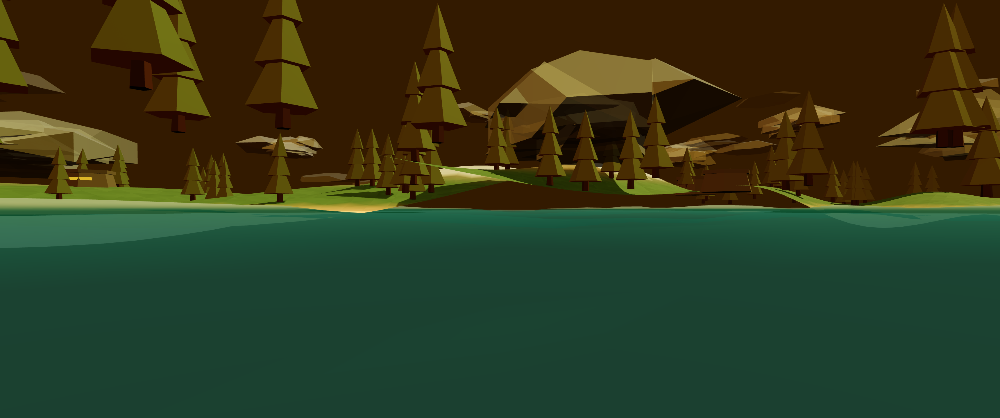
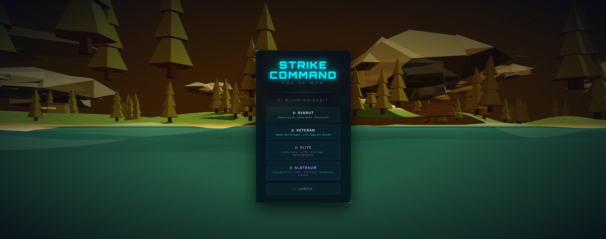
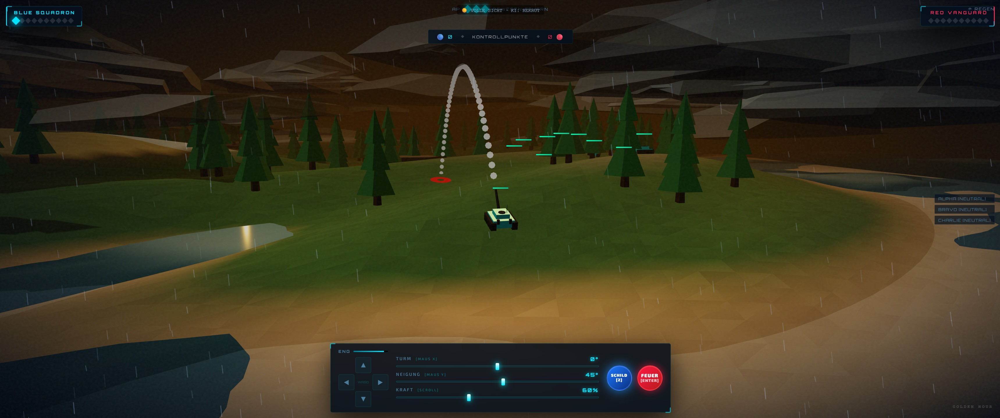

# Strike Command: Fog of War

Strike Command: Fog of War is a premium, procedurally generated 3D tactical artillery game built with **Three.js** (WebGL) and styled with a sleek futuristic cyber-military aesthetic. Players engage in tactical turn-based combat, controlling a squad of tanks, capturing control points, and outmaneuvering the enemy under dynamic weather and diurnal atmospheric lighting.

---

## 📸 Screenshots & Showcase

### 1. Tactical Battlefield & Procedural Terrain
Procedurally generated heights, custom coastal ocean swells, and dynamic lighting create a vibrant and immersive battlefield.


### 2. Aiming & Projectile Cam (Missile View)
Aim your turret, adjust power, and watch your shells fly in a picture-in-picture missile cam view.


### 3. Detailed Kampfbericht (After-Action Statistics)
Track your shots fired, hit accuracy, total damage, neutralizations, and captured control points.


---

## 🇩🇪 Deutsche Spielanleitung

### 🎯 Ziel des Spiels
Es gibt zwei Wege, um die Partie zu gewinnen:
1. **Vernichtung**: Vernichten Sie alle 10 feindlichen Panzer des Gegners.
2. **Kontrollpunkte**: Sammeln Sie als Erster **12 Kontrollpunkt-Punkte** (oder den durch das Schwierigkeits-Preset festgelegten Wert). Am Ende jeder Runde erhalten Sie für jeden vollständig gehaltenen Kontrollpunkt (+3 Runden kontinuierliche Präsenz) **+1 Punkt**. Falls Sie einen Kontrollpunkt einnehmen, der zuvor dem Gegner gehörte, erhalten Sie einen Rückeroberungs-Bonus.

### 🎮 Rundenablauf & Aktionspunkte (AP)
Jede Runde erhalten Sie **3 Aktionspunkte (AP)** pro aktivem Panzer. Verwalten Sie Ihre Ressourcen weise:
- **Bewegen (WASD / D-Pad)** (Kostet **1 AP**): Fahren Sie Ihren Panzer. Der verbleibende Treibstoff wird im HUD angezeigt. Sie können die Bewegung beliebig oft unterbrechen, solange Sie Treibstoff haben.
- **Feuern** (Kostet **2 AP**): Richten Sie Ihren Turm aus und feuern Sie Ihr Projektil. Nach dem Schuss wechselt das Spiel in die **Positionierungsphase**, in der Sie verbleibenden Treibstoff nutzen können, um in Deckung zu fahren.
- **Schild aktivieren** (Kostet **2 AP**): Erzeugt eine Energiekuppel mit einem Radius von **67.5 Einheiten**. Projektile prallen von der Kuppel ab. Der Schild schrumpft jede Runde um 10% und erlischt nach 5 Runden.

### ⌨️ Steuerung
- **Auswahlphase**:
  - `A` / `D` oder Pfeiltasten `◀`/`▶`: Panzer wechseln.
  - `Enter` oder `Ziel Bestätigen`: Auswahl einloggen.
- **Aktionsphase**:
  - `W`, `A`, `S`, `D` oder D-Pad: Panzer fahren & lenken.
  - **Maus ziehen auf Panzer**: Turm horizontal drehen und Neigungswinkel anpassen.
  - **Mausrad scrollen auf Panzer**: Schusskraft (Power) einstellen.
  - **Maus ziehen auf freier Fläche**: Kamera um den Panzer rotieren (Orbit).
  - **Mausrad scrollen auf freier Fläche**: Kamera zoomen.
  - `Enter` oder `Feuer`-Button: Schuss abgeben.
  - `3` oder `Schild`-Button: Schild aktivieren.

### 💣 Munitionstypen
Wählen Sie Ihre Munition vor dem Schuss links unten im HUD aus:
1. **Standard (💥)** (Vorrat: `∞`): Basis-Schadensprofil (1.0x Schaden, 1.0x Explosionsradius).
2. **Panzerbrechend (⚡)** (Vorrat: `4`): 1.8x Schaden, aber kleinerer Explosionsradius (0.4x). Perfekt für direkte Treffer gegen gepanzerte Hüllen.
3. **Splitter (💣)** (Vorrat: `4`): 0.7x Schaden, aber doppelter Explosionsradius (2.0x). Ideal gegen eng beieinanderstehende Gegner oder verdeckte Positionen.
4. **Rauchgranate (🌫️)** (Vorrat: `3`): Verursacht 0 Schaden. Erzeugt für 10 Sekunden dichten Rauch, der die Sichtlinie (LOS) blockiert. **Taktischer Tipp**: KI-Panzer können keine Ziele ohne Sichtlinie (LOS) angreifen.

---

## 🇺🇸 English Guide

### 🎯 Objective
Achieve victory through one of two methods:
1. **Annihilation**: Destroy all 10 enemy tanks.
2. **Control Points**: Be the first to reach the target Control Point (CP) points (default: **12**). Amass +1 point at the end of each round for every captured CP (+3 turns of continuous presence). Capturing an enemy-held CP provides a recapture turnaround speed bonus.

### 🎮 Turn Loop & Action Points (AP)
Each turn grants **3 Action Points (AP)**. Manage your resources carefully:
- **Move (WASD / D-Pad)** (Costs **1 AP**): Drive your tank. Fuel levels are displayed on the HUD. You can interrupt movement at any time as long as you have fuel.
- **Fire** (Costs **2 AP**): Position your turret, set velocity, and shoot. Once fired, the game transitions into the **Positioning Phase**, allowing you to use remaining fuel to drive to safety.
- **Deploy Shield** (Costs **2 AP**): Generates a protective force field (radius of **67.5 units**). Projectiles bounce off the dome. The shield shrinks by 10% each round and expires after 5 rounds.

### ⌨️ Controls
- **Selection Phase**:
  - `A` / `D` or Left/Right arrow keys: Cycle active tanks.
  - `Enter` or `Confirm Target`: Lock in selection.
- **Action Phase**:
  - `W`, `A`, `S`, `D` or HUD D-Pad: Drive and steer.
  - **Click and drag on tank**: Rotate turret horizontally and adjust inclination angle.
  - **Scroll wheel on tank**: Adjust firing power.
  - **Click and drag on empty ground**: Orbit the camera.
  - **Scroll wheel on empty ground**: Zoom camera.
  - `Enter` or `Fire` button: Shoot.
  - `3` or `Shield` button: Deploy shield.

### 💣 Ammunition Properties
Select ammunition in the bottom-left HUD before firing:
1. **Standard (💥)** (Quantity: `∞`): Balanced profile (1.0x damage, 1.0x blast radius).
2. **Armor-Piercing (⚡)** (Quantity: `4`): High single-target impact (1.8x damage, 0.4x blast radius).
3. **Splinter (💣)** (Quantity: `4`): Wide area splash (0.7x damage, 2.0x blast radius).
4. **Smoke Grenade (🌫️)** (Quantity: `3`): 0 damage. Deploys dense smoke for 10 seconds, blocking Line of Sight (LOS). **Tactical Tip**: AI tanks cannot target units without direct Line of Sight.

---

## 📊 Difficulty Parameters Matrix

The game configures matches using difficulty parameters from `js/difficulty.js`. The settings dynamically configure world size, terrain ruggedness, visibility, and AI behavior budgets:

| Parameter | 1: REKRUT | 2: VETERAN | 3: ELITE | 4: ALBTRAUM |
| :--- | :--- | :--- | :--- | :--- |
| **Map Size** | 1500 | 1800 | 2100 | 2400 |
| **Terrain Ruggedness** | 0.60 | 1.00 | 1.35 | 1.65 |
| **Vegetation (Trees)** | 150 | 250 | 300 | 340 |
| **Bunkers Spawned** | 9 | 16 | 22 | 28 |
| **Control Points (CPs)** | 3 | 3 | 4 | 5 |
| **CP Score to Win** | 14 | 12 | 11 | 10 |
| **Fog of War (FOW)** | Disabled (Full visibility) | Enabled | Enabled | Enabled |
| **Player Vision Fraction** | 1.00 | 0.45 | 0.34 | 0.28 |
| **AI Vision Fraction** | 0.22 | 0.40 | 0.62 | 0.85 |
| **AI Active Tanks/Turn** | 1 | 2 | 3 | 4 |
| **AI Fuel per Turn** | 100 | 100 | 115 | 130 |
| **AI Base Aim Noise** | 1.10 | 0.25 | 0.07 | 0.02 |
| **AI Accuracy Solver Iterations**| Coarse scan | Mid refinement | High accuracy | Perfect accuracy |
| **Obstacle-Aware Shots** | Disabled | Disabled | Enabled | Enabled |
| **AI Needs direct LOS** | Enabled | Disabled | Disabled | Disabled |
| **AI Shield Usage Logic** | Never | Emergency only | Tactical | Proactive |
| **AI Weapon Intel (ammoIQ)** | Standard ammo only | Basic swap | Situational | Aggressive |
| **AI Cover-Seeking** | Disabled | Disabled | Enabled | Enabled |
| **AI Shoot and Scoot** | Disabled | Enabled | Enabled | Enabled |
| **AI Reposition Actions/Hide Phase**| 0 | 1 | 1 | 2 |
| **AI Starting HP** | 90 | 100 | 100 | 110 |
| **AI Starting Shields** | 1 | 2 | 3 | 3 |
| **Adaptive Rubber-Banding** | Assist Player (-1) | Neutral (0) | Assist AI (1) | Aggressive Assist AI (2) |

---

## ⚙️ Technical Design & Deep-Dive

Strike Command: Fog of War is engineered using a custom modular vanilla web system. It does not rely on heavy bundlers, making it highly lightweight and directly executable in modern browsers.

### 📁 Directory Layout

```
strike-commander/
├── index.html        # Main HTML skeleton linking stylesheet and scripts
├── style.css         # Responsive glassmorphism interface, scanlines & animations
├── README.md         # Full project documentation & screenshots
├── .gitignore        # Excludes development folders like .claude/
├── gfx/              # Game screenshots and visual assets
└── js/
    ├── globals.js    # Declares all shared global variables
    ├── constants.js  # Static configurations (MAP_SIZE, gravity, ammunition properties)
    ├── difficulty.js # Tiers configuration matrix (Rekrut, Veteran, Elite, Albtraum)
    ├── audio.js      # Procedural sound effects synthesizer using HTML5 Web Audio API
    ├── tacfeed.js    # Tactical notifications and combat log compiler
    ├── lighting.js   # LightingDirector managing time-of-day scenes and tone mapping
    ├── camera.js     # Camera director protecting manual zoom/yaw during action phases
    ├── weather.js    # Weather animator processing procedural rain, wind, and lightning flashes
    ├── world.js      # Generates procedural 3D terrain, custom ocean waves, and structures
    ├── fx.js         # Particle explosions, shockwaves, shield ripples, and shrapnel geometry
    ├── tank.js       # Models tank meshes, aligns them to uneven terrain, and processes FOW checks
    ├── ai.js         # A* pathfinding navgrid, dynamic role allocation, and adaptive rubber-banding
    └── game.js       # Main state machine, keyboard triggers, render loop, and turn flow orchestrator
```

### 🔊 Procedural Audio Synthesis (`js/audio.js`)

Rather than downloading large audio assets, the game synthesizes all sound effects procedurally in real-time using the browser's **Web Audio API**:

```
[Starter Osc] ──> [Filter] ──┐
[Diesel Oscs] ──> [Shaper] ──┼─> [Gain Node] ──> [Compressor] ──> [Speakers]
[Pink Noise]  ──> [Biquad] ──┘
```

- **Diesel Engines**: Synthesizes a layered chug. A sawtooth engine oscillator passes into a custom WaveShaper curve. An LFO (Low-Frequency Oscillator) modulates the chug rate, while pitch values map dynamically to speed variables (38Hz idle rumble to an 85Hz full-throttle roar). Unmodulated triangle oscillators generate a high-pitched gear whine.
- **Explosions**: Pink noise buffers are generated mathematically, then filtered through a wave-shaping distortion curve and lowpass filter sweep. A separate sine oscillator adds a deep sub-bass thump. Fragmentary shells trigger subsequent metallic shrapnel clicks using high-frequency noise bursts.
- **Projectile Whistle**: An ultrasonic sine frequency sweep that pitches down rapidly prior to projectile impact to create tension.
- **Reload ratchet**: Synthesized mechanical slider clicks using square waves and quick exponential ramps.

### 🗻 Procedural World Generation & Shaders (`js/world.js`)

- **Heightmap Terrain**: The terrain is generated procedurally by evaluating sum-of-sines equations at vertices. The heights are colored dynamically based on altitude (Sand below sea level, Grass, Rock, and Snow peaks).
- **Ocean Waves & Foam**: A custom WebGL shader deforms the water vertices using trigonometric wave swells. It computes the wave crests to blend in coastal foam textures.

### 🧠 Tactical AI & Pathfinding (`js/ai.js`)

The AI operates on a dynamic navigation grid generated based on terrain height and obstacles:
- **A* Pathfinding**: Finds optimal navigation routes on a cell-grid, bypassing trees, bunkers, and enemy shields.
- **Role Allocation**: AI units are divided into Attackers, Defenders (Holders), Flankers, and Supports. Defenders focus on control points, Flankers flank around, and Supports assist weakened allies.
- **Friendly-Fire Mitigation**: Before firing, the AI simulates the shot trajectory and checks if any allies fall within the explosion radius.
- **Rubber-Banding / Adaptive Heuristics**: The AI adjusts its targeting accuracy based on the match score difference. If the AI is trailing, it receives a minor accuracy boost; if leading, its shots contain more random offset.

---

## 🧮 Mathematical & Algorithmic Formulations

The game engine utilizes precise mathematical formulations to drive physics, graphics, audio, and AI.

### 1. Procedural Heightmap Formula
The height $H$ at coordinate $(x, z)$ is generated using a sum-of-sines noise calculation scaled by ruggedness $r$ and masked by a radial distance check to create an island structure:

$$d = \sqrt{x^2 + z^2}$$

$$\text{mask}(x, z) = \text{clamp}\left(1.0 - \left(\frac{d}{R_{\text{max}}}\right)^4, 0.0, 1.0\right)$$

$$A_{\text{amp}} = 0.55 + 0.45 \cdot r$$

$$h_0(x, z) = \sin(x \cdot f_1 + \phi_1) \cdot 15 \cdot A_{\text{amp}} + \cos(z \cdot f_2 + \phi_2) \cdot 15 \cdot A_{\text{amp}} + \sin(x \cdot f_3 + z \cdot f_4 + \phi_3) \cdot 8 \cdot A_{\text{amp}}$$

If ruggedness exceed $1.0$, a secondary high-frequency ridge layer is added:

$$rv = 1.0 - \left|\sin(x \cdot f_5 + z \cdot f_6 + \phi_4)\right|$$

$$H(x, z) = (h_0 + rv^2 \cdot 18 \cdot (r - 1.0) + 20) \cdot \text{mask}(x, z) - 3.0$$

Where:
* $R_{\text{max}} = \text{MAP\_SIZE} \times 0.45$
* $f_1, f_2, f_3, f_4, f_5, f_6$ are randomized frequency factors.
* $\phi_1, \phi_2, \phi_3, \phi_4$ are phase shifts randomized per match.

### 2. Ballistics Euler Integration
The trajectory of projectiles is calculated at discrete time steps $dt = 0.04$ using classical numerical integration.
Let $\vec{p} = (p_x, p_y, p_z)$ be position and $\vec{v} = (v_x, v_y, v_z)$ be velocity:

$$\vec{v}_{t+1} = \vec{v}_t + \vec{g} \cdot dt$$

$$\vec{p}_{t+1} = \vec{p}_t + \vec{v}_{t+1} \cdot dt$$

Where:
* $\vec{g} = (0, -60, 0)$ is the gravity vector.
* Collision is detected when $p_y \le H(p_x, p_z)$.

### 3. A* Pathfinding Grid and Heuristic
The pathfinding navigation grid maps the island coordinates into cells of size $30 \times 30$ units. Cells are blocked if $H(x, z) < 1.0$ (water), or if a bunker, tree, or enemy force shield falls within the cell radius.

The routing search evaluates node scores using the function:

$$f(n) = g(n) + h(n)$$

Where:
* $g(n)$ is the exact movement cost from start node to current node $n$ (horizontal/vertical step = 10, diagonal step = 14).
* $h(n)$ is the heuristic estimated cost to target, computed via Manhattan distance:

$$h(n) = (\left|x_{\text{node}} - x_{\text{target}}\right| + \left|z_{\text{node}} - z_{\text{target}}\right|) \times 10$$

### 4. AI Targeting Trajectory Solver
The AI searches for the optimal turret rotation angle $\theta$, elevation pitch $\alpha$, and initial velocity power $v_0$ to hit target $\vec{p}_{\text{target}}$:
1. **Yaw Alignment**: Calculates exact rotation angle directly:

$$\theta = -\arctan2(\Delta x, \Delta z) - \theta_{\text{tank\_heading}}$$

2. **Pitch and Power Search**: Iterates over elevation angles $\alpha \in [5^\circ, 85^\circ]$ in steps of $5^\circ$ and velocities $v_0 \in [20, 150]$ in steps of $10$.
3. **Euler Simulation**: Runs the path simulation loop for each test candidate. The candidate with the smallest distance $d = \left\|\vec{p}_{\text{impact}} - \vec{p}_{\text{target}}\right\|$ is cached.
4. **Fine Scan**: If the closest distance is less than $400$ units, the AI performs a narrow-range nested search around the best candidate, scanning angles in $1^\circ$ intervals and power in steps of $3$ to achieve sub-unit precision.

### 5. Adaptive AI (Rubber-Banding) Heuristic
The score difference $\Delta$ maps the relative lead of the player. Positive values indicate the player is winning:

$$\Delta = (T_{1,\text{alive}} - T_{2,\text{alive}}) \cdot 12 + (\text{HP}_{1,\text{total}} - \text{HP}_{2,\text{total}}) \cdot 0.08 + (S_{1,\text{CP}} - S_{2,\text{CP}}) \cdot 4$$

Where:
* $T_1$ refers to the Player team, and $T_2$ to the AI team.
* $\text{HP}$ is the sum of alive tank health values.
* $S_{\text{CP}}$ represents the current Control Point scores.

Based on the difficulty setting's rubberband factor $rb$:
* **Aiming Noise Multiplier**:
  $$\text{Noise}_{\text{final}} = \text{Noise}_{\text{base}} \times (1.0 - \text{AccuracyMod})$$
  Where $\text{AccuracyMod}$ increases positive aiming accuracy when the AI is trailing, and degrades it when leading.
* **Bonus Actions**:
  Grants the AI extra active tank actions per turn when $\Delta$ is high.

### 6. Procedural Engine Synthesizer Formula
The engine sound utilizes a custom wave shaper to map a sawtooth wave $x \in [-1, 1]$ into a rich diesel chug:

$$f(x) = x^5 \cdot 2.0 - 1.0$$

The base frequency $F_{\text{fund}}$ scale linearly with normal speed ratio:

$$F_{\text{fund}} = 30 + \left(\frac{v}{v_{\text{max}}}\right) \cdot 28 \text{ Hz}$$

---

## 🚀 Running Locally

Since the game uses custom shaders and Web Audio modules, it is best run through a local web server (to avoid CORS policies on local file access):

1. **Serve the folder**:
   Using python:
   ```bash
   python -m http.server 8000
   ```
   Or using node:
   ```bash
   npx serve .
   ```
2. **Open your browser**:
   Navigate to `http://localhost:8000` (or the port specified).
